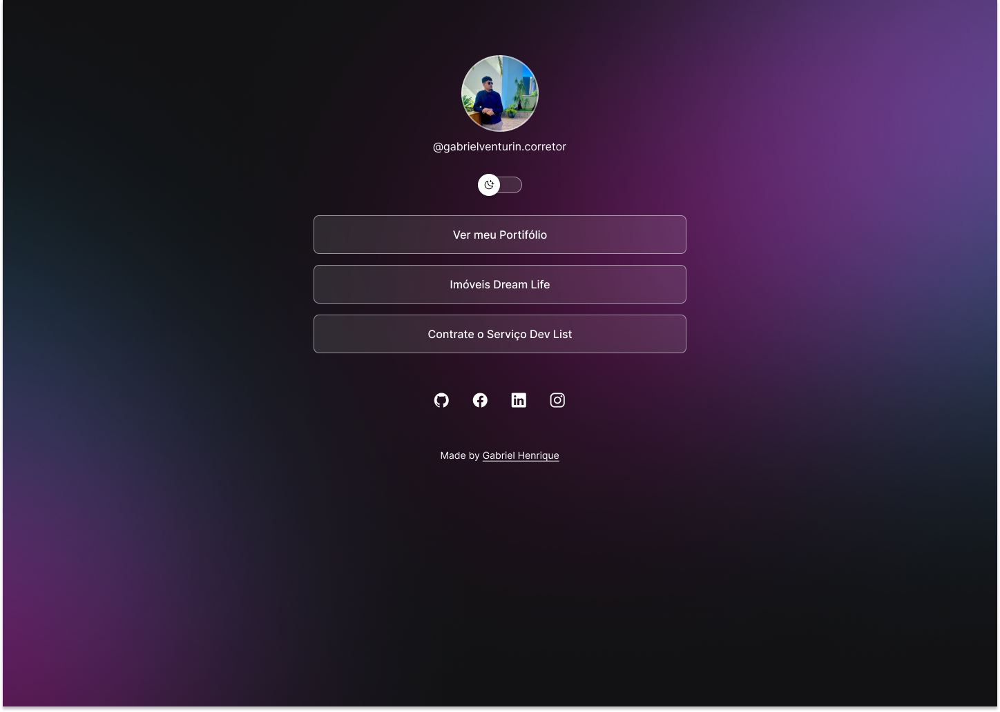

<h1 align="center"> DevLinks </h1>

Programa exclusívo e gratuito, promovido pela Rocketseat para ensino de tecnologias WEB.

<a href="#-tecnologias">Tecnologias</a>&nbsp;&nbsp;&nbsp; |&nbsp;&nbsp;&nbsp;&nbsp;
<a href="#-projeto">Projeto</a>&nbsp;&nbsp;&nbsp;|&nbsp;&nbsp;&nbsp;
<a href="#-layout">Layout</a>&nbsp;&nbsp;&nbsp;|&nbsp;&nbsp;&nbsp;
<a href="#-memo-licença">Licença</a>

## 🚀 Tecnologias

Esse projeto foi desenvolvido com as seguintes tecnologias:

- HTML e CSS
- JavaScript
- Git e Github
- FIGMA

## 💻 Projeto

O DevLinks é um agregador de links para usar como cartão de visitas online.

## 📘 Projeto feito como forma de estudos

Esse projeto foi feito como formato de estudos em colaboração com a Rocketseat.git